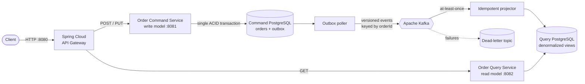

# CQRS Microservices Architecture Showcase

[](https://github.com/karacsonybarni/microservices-architecture/actions/workflows/ci.yml)
[](https://spring.io/projects/spring-boot)
[](https://adoptium.net/)

An interview-ready reference implementation of Command Query Responsibility Segregation (CQRS) with Spring Boot. It demonstrates the production concerns that make CQRS meaningful: independently owned databases, asynchronous projections, a transactional outbox, idempotent commands and consumers, ordered versioned events, dead-letter handling, schema migrations, an API gateway, observability, and one-command local startup.

The design follows the pattern language in [microservices.io's microservice architecture](https://microservices.io/patterns/microservices.html), especially [CQRS](https://microservices.io/patterns/data/cqrs.html), [Database per Service](https://microservices.io/patterns/data/database-per-service.html), [API Gateway](https://microservices.io/patterns/apigateway.html), [Transactional Outbox](https://microservices.io/patterns/data/transactional-outbox.html), and [Idempotent Consumer](https://microservices.io/patterns/communication-style/idempotent-consumer.html).

## Architecture at a glance



| Component | Responsibility | Data ownership |
| --- | --- | --- |
| `api-gateway` | Method-aware routing and correlation IDs | None |
| `order-command-service` | Validates and executes create/cancel commands | Order aggregate, command deduplication, outbox |
| `order-query-service` | Projects events and serves query-optimized responses | Order read model, processed-event IDs |
| Kafka | Durable asynchronous event transport | `orders.events.v1` and its DLT |

The write and read services share neither a database nor a Java model. Their only integration contract is the versioned event envelope. This keeps the CQRS boundary visible instead of hiding it inside one process.

## Run the complete system

Prerequisites: Docker with Compose, Java 21+, `curl`, and `jq`.

```bash
make up
make smoke
```

`make up` builds all services and waits for health checks. `make smoke` proves the complete flow through the gateway:

1. create an order;
2. repeat the command with the same idempotency key;
3. prove that reusing the key for a different payload returns `409 Conflict`;
4. wait for the Kafka-driven read projection;
5. verify the calculated total and event version;
6. cancel the order; and
7. verify the eventual read-model transition from `CREATED` to `CANCELLED`.

Stop the stack and delete its local volumes with:

```bash
make down
```

## Try the API manually

All client traffic enters through `http://localhost:8080`.

```bash
curl --request POST http://localhost:8080/api/orders \
  --header 'Content-Type: application/json' \
  --header 'Idempotency-Key: interview-demo-1' \
  --data '{
    "customerId": "customer-42",
    "items": [
      {"productId": "keyboard", "quantity": 1, "unitPrice": 129.90},
      {"productId": "mouse", "quantity": 2, "unitPrice": 39.50}
    ]
  }'
```

The command returns `202 Accepted` because the write has committed but the read model is updated asynchronously. Use its `orderId` to query and cancel:

```bash
curl http://localhost:8080/api/orders/{orderId}
curl --request PUT http://localhost:8080/api/orders/{orderId}/cancellation
curl 'http://localhost:8080/api/orders?customerId=customer-42&status=CANCELLED'
```

Service-local API documentation is available at:

- Command API: [http://localhost:8081/swagger-ui.html](http://localhost:8081/swagger-ui.html)
- Query API: [http://localhost:8082/swagger-ui.html](http://localhost:8082/swagger-ui.html)
- Health: [http://localhost:8080/actuator/health](http://localhost:8080/actuator/health)
- Prometheus metrics: `/actuator/prometheus` on every service

## Reliability semantics

This project makes its guarantees explicit:

- **No database/Kafka dual write:** the command service stores the aggregate and outbox row in one local transaction.
- **At-least-once delivery:** the outbox publisher marks an event only after Kafka acknowledges it. A crash in between can publish a duplicate.
- **Idempotent projection:** `processed_events.event_id` makes duplicate delivery harmless.
- **Per-order ordering:** PostgreSQL assigns each outbox row a monotonic relay sequence, the publisher polls by that sequence, and all events use `orderId` as the Kafka key. `aggregateVersion` remains the projection guard.
- **Poison-message isolation:** projection failures retry twice and then move to `orders.events.v1.DLT`.
- **Idempotent client retries:** PostgreSQL atomically claims `Idempotency-Key`; concurrent retries of the same logical create command resolve to one order and one outbox event. The key is bound to a deterministic request fingerprint, so a different payload returns `409 Conflict`.
- **Honest eventual consistency:** query responses include `X-Data-Consistency: eventual`; a new order may briefly return `404` from the read side.

See [Architecture](docs/architecture.md) for the detailed flows and [ADR-001](docs/adr/001-cqrs-and-transactional-outbox.md) for the main trade-offs.

## Build and test

```bash
./mvnw clean verify
docker compose config --quiet
```

The test suite includes PostgreSQL-backed concurrent command and relay-ordering tests in addition to aggregate invariants, event contract shape, duplicate consumer delivery, stale event versions, projection transitions, and gateway correlation IDs. The runtime smoke test covers both databases, Flyway migrations, Kafka transport, gateway routing, idempotency conflict handling, and eventual consistency end to end.

## Interview discussion guide

Good questions to explore from this codebase:

- Why CQRS here? The read side can evolve and scale independently, and expensive query shapes do not compromise the write aggregate. The cost is eventual consistency and operational complexity.
- Why an outbox instead of publishing in the controller? A process crash cannot leave a committed order with no durable event intent.
- Why not claim exactly-once delivery? Kafka and a relational database do not share one transaction. At-least-once plus idempotency gives a simpler, observable guarantee.
- Why a polling publisher? It is transparent and easy to run locally. At larger scale, Change Data Capture (for example Debezium) can replace the poller without changing the domain transaction.
- Why separate PostgreSQL containers? Database per service is an ownership boundary, not merely separate table names.
- Why no shared event library? Independently deployable services should not require lockstep Java releases. The event name is versioned and each consumer owns its local representation.
- What would production add? OAuth2/OIDC at the gateway, TLS and ACLs, a schema registry or consumer-driven contracts, Debezium, distributed tracing, alerting on outbox lag and DLT depth, and orchestration manifests.

## Technology baseline

- Java 21 LTS
- Spring Boot 4.1.1
- Spring Cloud 2025.1.2 / Spring Cloud Gateway
- Spring Data JPA, Flyway, PostgreSQL
- Spring for Apache Kafka / Apache Kafka in KRaft mode
- springdoc-openapi 3.1.0
- Micrometer Actuator and Prometheus metrics
- Maven Wrapper, Docker Compose, GitHub Actions, Dependabot

## Repository map

```text
api-gateway/             HTTP entry point and routing
order-command-service/  write aggregate, command API, transactional outbox
order-query-service/    Kafka projection, read model, query API
docs/                    architecture narrative and decisions
scripts/smoke-test.sh    executable end-to-end acceptance flow
compose.yml              complete local platform
```

## License

MIT
