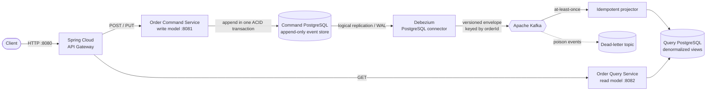

# Event-Sourced CQRS Microservices

[](https://github.com/karacsonybarni/microservices-architecture/actions/workflows/ci.yml)
[](https://spring.io/projects/spring-boot)
[](https://adoptium.net/)
[](https://debezium.io/)

A runnable reference architecture combining Command Query Responsibility Segregation (CQRS), event sourcing, and Debezium change data capture. The command database stores immutable domain events as the source of truth, Debezium streams committed inserts to Kafka, and the query service builds a disposable read model.

The design follows the pattern language at [microservices.io](https://microservices.io/patterns/microservices.html), especially [Event Sourcing](https://microservices.io/patterns/data/event-sourcing.html), [CQRS](https://microservices.io/patterns/data/cqrs.html), [Database per Service](https://microservices.io/patterns/data/database-per-service.html), [API Gateway](https://microservices.io/patterns/apigateway.html), and [Idempotent Consumer](https://microservices.io/patterns/communication-style/idempotent-consumer.html).

## Architecture at a glance



| Component | Responsibility | Data ownership |
| --- | --- | --- |
| `api-gateway` | Method-aware routing and correlation IDs | None |
| `order-command-service` | Validates commands, replays aggregates, appends events | Event streams and command deduplication |
| Debezium | Captures committed event inserts from PostgreSQL WAL | Replication offset and connector state |
| `order-query-service` | Projects events and serves query-optimized responses | Order read model and processed-event IDs |
| Kafka | Durable asynchronous transport | `orders.events.v1` and `orders.events.v1.DLT` |

The write and read services share neither a database nor a Java model. Their integration contract is the versioned event envelope stored in `order_events` and emitted unchanged by Debezium.

## Run the complete system

Prerequisites: Docker with Compose, Java 21+, `curl`, and `jq`.

```bash
make up
make smoke
```

`make up` compiles the services, starts PostgreSQL, Kafka, Debezium, and the APIs, registers the connector idempotently, and waits for health checks. `make smoke` proves this flow through the gateway:

1. create an order;
2. repeat the same command and verify idempotent replay;
3. reuse the key with another payload and verify `409 Conflict`;
4. wait for Debezium and Kafka to update the query model;
5. cancel the order; and
6. verify the read model advances from event version 1 to 2.

Stop the stack and remove its local volumes with:

```bash
make down
```

## Try the API manually

All client traffic enters through `http://localhost:8080`.

```bash
curl --request POST http://localhost:8080/api/orders \
  --header 'Content-Type: application/json' \
  --header 'Idempotency-Key: order-demo-1' \
  --data '{
    "customerId": "customer-42",
    "items": [
      {"productId": "keyboard", "quantity": 1, "unitPrice": 129.90},
      {"productId": "mouse", "quantity": 2, "unitPrice": 39.50}
    ]
  }'
```

The command returns `202 Accepted` after the event-store transaction commits. Use the returned `orderId` to query and cancel:

```bash
curl http://localhost:8080/api/orders/{orderId}
curl --request PUT http://localhost:8080/api/orders/{orderId}/cancellation
curl 'http://localhost:8080/api/orders?customerId=customer-42&status=CANCELLED'
```

Operational endpoints:

- Command API: [http://localhost:8081/swagger-ui.html](http://localhost:8081/swagger-ui.html)
- Query API: [http://localhost:8082/swagger-ui.html](http://localhost:8082/swagger-ui.html)
- Debezium Connect: [http://localhost:8083/connectors/order-events/status](http://localhost:8083/connectors/order-events/status)
- Gateway health: [http://localhost:8080/actuator/health](http://localhost:8080/actuator/health)
- Prometheus metrics: `/actuator/prometheus` on every Spring service

## Event-sourcing and delivery guarantees

- **Events are authoritative:** an `Order` is reconstructed by replaying its ordered event stream; no mutable order table exists.
- **Append-only enforcement:** PostgreSQL rejects `UPDATE` and `DELETE` against `order_events`, and a unique `(aggregate_id, aggregate_version)` constraint rejects conflicting stream positions.
- **Optimistic stream version plus row serialization:** `aggregate_streams.current_version` is concurrency metadata. A row lock serializes concurrent transitions while the event history remains the source of aggregate state.
- **No application-level database/Kafka dual write:** the command transaction ends after appending the event. Debezium reads only committed WAL changes and owns publication to Kafka.
- **At-least-once delivery:** connector or consumer recovery can redeliver a record. `processed_events.event_id` makes projection replay harmless.
- **Per-order ordering:** every event has a contiguous aggregate version and uses `orderId` as its Kafka key, preserving the partition-ordering boundary.
- **Poison-event isolation:** projection failures retry twice and then move to `orders.events.v1.DLT`.
- **Idempotent client retries:** PostgreSQL atomically claims `Idempotency-Key` and binds it to a deterministic request fingerprint.
- **Honest eventual consistency:** query responses include `X-Data-Consistency: eventual`; a newly committed order may briefly be absent from the read side.

See [Architecture](docs/architecture.md) for the detailed mechanics and [ADR-001](docs/adr/001-event-sourcing-and-debezium-cdc.md) for the main trade-offs.

## Verification

```bash
./mvnw clean verify
docker compose config --quiet
make up
make smoke
```

The test suite covers aggregate replay, versioned serialization, append-only database enforcement, concurrent create/cancel commands, idempotent command fingerprints, duplicate event delivery, stale projection versions, dead-letter routing, API behavior, and gateway correlation IDs. The smoke test adds real PostgreSQL logical decoding, Debezium, Kafka, both databases, Flyway, and all HTTP services.

## Technology baseline

- Java 21 LTS
- Spring Boot 4.1.1
- Spring Cloud 2025.1.3 and Spring Cloud Gateway
- Spring Data JPA, Flyway, PostgreSQL 18
- Debezium 3.6.1.Final PostgreSQL connector
- Spring for Apache Kafka and Apache Kafka 4.3.1 in KRaft mode
- springdoc-openapi 3.1.0
- Micrometer Actuator and Prometheus metrics
- Maven Wrapper, Docker Compose, GitHub Actions, Dependabot

## Repository map

```text
api-gateway/             HTTP entry point and routing
order-command-service/  event-sourced aggregate, event store, command API
order-query-service/    Kafka projection, read model, query API
debezium/                replication user and connector registration
docs/                    architecture narrative and decisions
scripts/smoke-test.sh    executable end-to-end acceptance flow
compose.yml              complete local platform
```

## License

MIT
