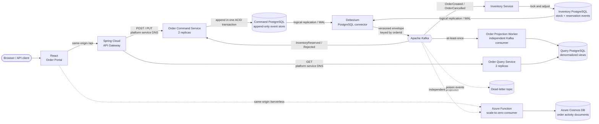

# Event-Sourced CQRS Microservices

[](https://github.com/karacsonybarni/event-sourced-cqrs-microservices/actions/workflows/ci.yml)
[](https://github.com/karacsonybarni/event-sourced-cqrs-microservices/actions/workflows/deploy-azure.yml)
[](https://github.com/karacsonybarni/event-sourced-cqrs-microservices/actions/workflows/deploy-aws.yml)
[](https://spring.io/projects/spring-boot)
[](https://adoptium.net/)
[](https://debezium.io/)

## Live deployments

- **Azure:** [React order portal and public API](https://escqrs-62636a3dc4.polandcentral.cloudapp.azure.com)
- **AWS:** [Public API](https://n6jxpgtbrc.execute-api.eu-central-1.amazonaws.com/)

A runnable reference architecture combining a React customer portal, Command Query Responsibility Segregation (CQRS), selective event sourcing, a choreographed Order–Inventory saga, Debezium change data capture, horizontal scaling, and a Kubernetes-managed Azure application tier. Order and inventory-reservation lifecycles are immutable event streams, Debezium publishes committed inserts to Kafka, an independently deployable projection worker builds the disposable read model, and replicated query services serve it.

The design follows the pattern language at [microservices.io](https://microservices.io/patterns/microservices.html), especially [Event Sourcing](https://microservices.io/patterns/data/event-sourcing.html), [Saga](https://microservices.io/patterns/data/saga.html), [CQRS](https://microservices.io/patterns/data/cqrs.html), [Database per Service](https://microservices.io/patterns/data/database-per-service.html), [API Gateway](https://microservices.io/patterns/apigateway.html), and [Idempotent Consumer](https://microservices.io/patterns/communication-style/idempotent-consumer.html).

## Architecture at a glance



| Component | Responsibility | Data ownership |
| --- | --- | --- |
| `frontend` | Customer order workflow and live architecture proof | None |
| `api-gateway` | Method-aware routing and correlation IDs | None |
| `order-command-service` | Validates commands, replays aggregates, appends events | Event streams and command deduplication |
| `inventory-service` | Reserves stock, rejects unavailable orders, and compensates cancellation | Transactional stock plus event-sourced reservation streams |
| Debezium | Captures committed event inserts from PostgreSQL WAL | Replication offset and connector state |
| `order-projection-worker` | Consumes order events and transactionally materializes the relational CQRS read model | Write path to order read model and processed-event IDs |
| `order-query-service` | Serves read-only query-optimized responses | Read-only access to the order read model |
| `order-activity-function` | Builds an independently scalable activity timeline | Cosmos DB documents keyed by event and partitioned by order |
| Kafka | Durable asynchronous transport | Order and inventory event topics plus consumer-specific dead-letter topics |

Domain services share neither databases nor Java domain models. The projection worker and query API are deliberately separate deployables within one CQRS read-side component: they share `order-query-model` and the query PostgreSQL database because they operate on the same materialized view and schema. Integration between domain services still uses versioned envelopes stored in `order_events` and `inventory_events` and emitted unchanged by Debezium.

## Run the complete system

Prerequisites: Docker with Compose, Java 21+, `curl`, and `jq`.

```bash
make up
make smoke
make ui-smoke
```

`make up` compiles the services, builds the React application, starts three PostgreSQL databases, Kafka, Debezium, the gateway, Inventory, the order portal, one projection worker, two command-service replicas, and two query-service replicas, registers both CDC connectors idempotently, and waits for health checks. Compose service DNS connects the gateway to the replicated command and query services. Open [http://localhost:3000](http://localhost:3000) or run `make ui-smoke` to verify the local UI. `make smoke` proves this flow through the gateway:

1. create an order;
2. repeat the same command and verify idempotent replay;
3. reuse the key with another payload and verify `409 Conflict`;
4. wait for Inventory to reserve stock and the order to reach `CONFIRMED` at version 2;
5. cancel the order and verify `InventoryReleased.v1` restores the stock balance;
6. verify the read model reaches `CANCELLED` at version 3; and
7. create an unavailable order and verify it reaches `REJECTED` without reducing stock.

The primary CQRS read side intentionally separates event ingestion from request serving. `order-projection-worker` owns Kafka consumption and materialization, while `order-query-service` only reads the already-materialized model. They can be rolled out and scaled independently without pretending that they are independent data-owning services. See [ADR-008](docs/adr/008-independent-cqrs-projection-worker.md) for the boundary and trade-offs, and [ADR-009](docs/adr/009-platform-native-service-routing.md) for the platform service-routing contract.

The Azure image enables an additional portal proof that independently verifies the created, confirmed, and cancelled order events in Cosmos DB through the read-only Function route. The local image omits this cloud-only step while retaining the complete saga and CQRS flow.

`make scale-smoke` then stops every command and query replica in turn. It verifies that Compose removes the stopped container from the running service set and that the gateway continues routing commands and queries through platform DNS to the surviving replica before restoring the full topology. The projection worker is independent of that HTTP replica test.

The Maven reactor also packages `order-activity-function`, a Java 21 Azure Function that consumes the same Kafka event contract and writes an idempotent document projection to Azure Cosmos DB. The Azure deployment places it on Flex Consumption with private virtual-network access to Kafka, managed-identity access to Cosmos DB, and a read-only same-origin activity route. It remains an independent cloud extension rather than a dependency of the local order path. See [ADR-005](docs/adr/005-serverless-nosql-activity-projection.md) for its boundary and deployment trade-offs.

Stop the stack and remove its local volumes with:

```bash
make down
```

## Deploy to Azure

The repository includes a credit-protected Azure deployment with Terraform, Azure Virtual Network, a hardened Linux VM, a checksum-verified K3s cluster, Azure Functions Flex Consumption, Cosmos DB for NoSQL, private storage endpoints and DNS, private versioned Blob state, managed identities, GitHub Actions OIDC, Azure Run Command, boot diagnostics, a resource-group budget, stable DNS, and Caddy-managed HTTPS. Kubernetes owns the stateless application tier, including the independent order projection worker, and its Services and DNS route application traffic; Compose retains PostgreSQL, Kafka, and Debezium so the migration preserves durable state and connector offsets. Provisioning still refuses to proceed unless the Azure subscription is enabled with spending protection set to `On`.

Live React order portal and public API: [https://escqrs-62636a3dc4.polandcentral.cloudapp.azure.com](https://escqrs-62636a3dc4.polandcentral.cloudapp.azure.com)

See [Azure cloud deployment](docs/azure-deployment.md) for the architecture, provisioning command, Kubernetes boundary, security model, cost boundary, delivery flow, operations, and teardown procedure. [ADR-004](docs/adr/004-credit-protected-azure-deployment.md) records why the complete topology uses promotional credit on one 8-GiB VM instead of the undersized 12-month free VM shapes; [ADR-007](docs/adr/007-incremental-kubernetes-application-tier.md) records the incremental Kubernetes migration and its production boundary; [ADR-008](docs/adr/008-independent-cqrs-projection-worker.md) records the query/projection runtime split.

## Preserved AWS deployment

The AWS deployment remains fully described and reproducible with Terraform, Amazon API Gateway, EC2, VPC networking, IAM, Systems Manager, CloudWatch, S3 remote state, GitHub Actions OIDC, automated delivery, and public end-to-end verification. Its remote state and runtime resources are intentionally preserved while AWS automatic delivery is paused.

Last assigned API endpoint: `https://n6jxpgtbrc.execute-api.eu-central-1.amazonaws.com/`

See [AWS cloud deployment](docs/aws-deployment.md) for the architecture, provisioning command, security model, operations, cost controls, and teardown procedure. [ADR-003](docs/adr/003-cost-optimized-aws-deployment.md) records why the economical topology uses one deployment host and how it evolves into managed production services.

## Try the API manually

All client traffic enters through `http://localhost:8080`.

```bash
curl --request POST http://localhost:8080/api/orders \
  --header 'Content-Type: application/json' \
  --header 'Idempotency-Key: order-demo-1' \
  --data '{
    "customerId": "customer-42",
    "items": [
      {"productId": "mechanical-keyboard", "quantity": 1, "unitPrice": 129.90},
      {"productId": "wireless-mouse", "quantity": 2, "unitPrice": 39.50}
    ]
  }'
```

The command returns `202 Accepted` after the event-store transaction commits. Use the returned `orderId` to query and cancel:

```bash
curl http://localhost:8080/api/orders/{orderId}
curl --request PUT http://localhost:8080/api/orders/{orderId}/cancellation
curl 'http://localhost:8080/api/orders?customerId=customer-42&status=CANCELLED'
```

Operational endpoints:

- Debezium Connect: [order connector](http://localhost:8083/connectors/order-events/status) and [inventory connector](http://localhost:8083/connectors/inventory-events/status)
- Gateway health: [http://localhost:8080/actuator/health](http://localhost:8080/actuator/health)
- Prometheus metrics: `/actuator/prometheus` on every Spring service

Backend replicas receive random host ports so they can scale without collisions. Resolve a replica's host port when direct Swagger or Actuator access is needed:

```bash
docker compose port --index 1 order-command-service 8081
docker compose port --index 1 order-query-service 8082
docker compose port order-projection-worker 8085
docker compose port inventory-service 8084
```

## Event-sourcing and delivery guarantees

- **Events are authoritative:** an `Order` is reconstructed by replaying its ordered event stream; no mutable order table exists.
- **Selective event sourcing:** an `InventoryReservation` is reconstructed from reserved/rejected/released events, while the high-contention stock balance remains explicit transactional state.
- **Append-only enforcement:** PostgreSQL rejects `UPDATE` and `DELETE` against `order_events`, and a unique `(aggregate_id, aggregate_version)` constraint rejects conflicting stream positions.
- **Optimistic stream version plus row serialization:** `aggregate_streams.current_version` is concurrency metadata. A row lock serializes concurrent transitions while the event history remains the source of aggregate state.
- **Local saga atomicity:** inventory changes stock and appends its reservation event in one database transaction; Order and Inventory never share a transaction.
- **No application-level database/Kafka dual write:** each domain transaction ends after appending its event. Debezium reads only committed WAL changes and owns publication to Kafka.
- **At-least-once delivery:** connector or consumer recovery can redeliver a record. Consumer inbox tables and projection `processed_events` make replay harmless.
- **Independent read-side scaling:** the projection worker consumes Kafka separately from the replicated HTTP query service, so query traffic and projection throughput no longer share a replica count.
- **Explicit compensation:** `OrderCancelled.v1` releases an active reservation and appends `InventoryReleased.v1`; history is never edited.
- **Per-order ordering:** every event has a contiguous aggregate version and uses `orderId` as its Kafka key, preserving the partition-ordering boundary.
- **Poison-event isolation:** projection failures retry twice and then move to `orders.events.v1.DLT`.
- **Idempotent serverless projection:** the activity document ID is the immutable `eventId`, so Kafka redelivery overwrites the same document in the same order partition.
- **Idempotent client retries:** PostgreSQL atomically claims `Idempotency-Key` and binds it to a deterministic request fingerprint.
- **Honest eventual consistency:** query responses include `X-Data-Consistency: eventual`; a newly committed order may briefly be absent from the read side.

See [Architecture](docs/architecture.md), [ADR-001](docs/adr/001-event-sourcing-and-debezium-cdc.md), [ADR-006](docs/adr/006-choreographed-order-inventory-saga.md), and [ADR-008](docs/adr/008-independent-cqrs-projection-worker.md) for the detailed mechanics and trade-offs.

## Verification

```bash
./mvnw clean verify
docker compose config --quiet
make kubernetes-validate
make up
make smoke
make scale-smoke
GATEWAY_URL=https://escqrs-62636a3dc4.polandcentral.cloudapp.azure.com ./scripts/serverless-smoke-test.sh
```

The test suite covers both aggregate lifecycles, versioned serialization, append-only database enforcement, stock reservation and compensation, concurrent create/cancel commands, idempotent command fingerprints, duplicate event delivery, stale projection versions, dead-letter routing, API behavior, gateway correlation IDs, and platform-service route configuration. The smoke tests add real PostgreSQL logical decoding, two Debezium connectors, Kafka, the independent projection worker, platform health checks, replica failover, all three databases, Flyway, and all HTTP services.

## Technology baseline

- Java 21 LTS
- React 19.2, TypeScript 6, Vite 8.2, and Nginx
- Spring Boot 4.1.1
- Spring Cloud 2025.1.3 and Spring Cloud Gateway
- Spring Data JPA, Flyway, PostgreSQL 18
- Debezium 3.6.1.Final PostgreSQL connector
- Spring for Apache Kafka and Apache Kafka 4.3.1 in KRaft mode
- Azure Functions Java library 3.3.0 and Maven plugin 1.42.0
- Azure Cosmos DB for NoSQL document projection
- springdoc-openapi 3.1.0
- Micrometer Actuator and Prometheus metrics
- Kubernetes 1.36 through K3s, Kustomize, Docker Compose, GitHub Actions, Dependabot
- Terraform, Azure Virtual Network, Linux VM, Entra workload identity federation, Run Command, Blob state, budgets, DNS, and HTTPS
- Terraform, AWS API Gateway, EC2, VPC, IAM, Systems Manager, CloudWatch, and S3 remote state

## Repository map

```text
api-gateway/               HTTP entry point and routing
frontend/                  React customer portal and architecture proof
order-command-service/     event-sourced aggregate, event store, command API
inventory-service/         stock consistency and event-sourced reservation lifecycle
order-query-model/         shared relational CQRS read model and Flyway schema
order-projection-worker/   Kafka-to-query-PostgreSQL projection worker
order-query-service/       read-only CQRS query API
order-activity-function/   serverless Kafka-to-Cosmos activity projection
debezium/                  replication user and connector registration
docs/                      architecture narrative and decisions
scripts/                   end-to-end and multi-replica failover checks
infra/aws/                 Terraform state bootstrap and AWS runtime infrastructure
infra/azure/               Terraform state bootstrap and Azure runtime infrastructure
deploy/kubernetes/         Kubernetes base resources and Azure Kustomize overlay
compose.yml                complete local platform
compose.cloud.yml          cloud-only exposure, resource, secret, and logging policy
compose.azure.yml          Azure exposure, resource, secret, logging, and HTTPS policy
compose.kubernetes-platform.yml private host bindings for retained Azure platform services
```

## License

MIT