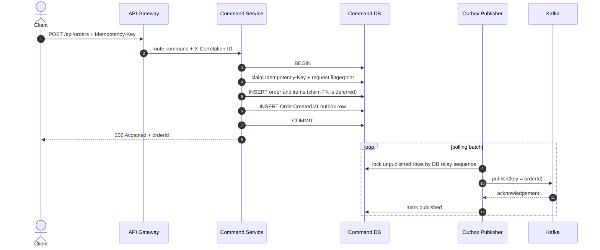
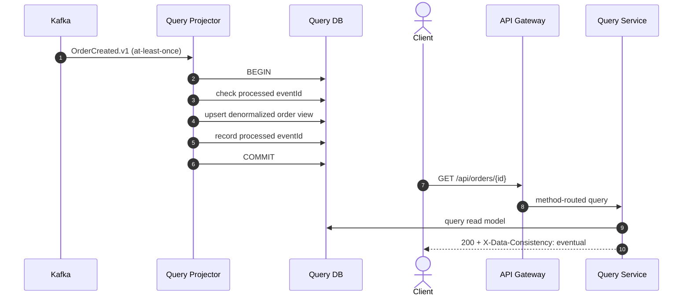

# Architecture

## Context and goals

This is a deliberately small order domain wrapped in realistic distributed-systems mechanics. The goal is to make the architectural decisions inspectable: every service owns its schema, writes never depend on the query database, and all cross-service state propagation is observable as a versioned event.

The sample optimizes for clarity, local reproducibility, and an honest delivery model. It is not a claim that every CRUD service needs CQRS.

## Command flow



The command response confirms the write-side transaction only. It does not pretend that the asynchronously updated query model is already current.

## Projection and query flow



Spring Kafka acknowledges the record only after the transactional listener returns. If database work succeeds but offset acknowledgement does not, Kafka redelivers and the processed-event check turns the replay into a no-op.

## Event contract

Every message uses an envelope such as:

```json
{
  "eventId": "b67c1f1c-c391-4ef0-a1b2-c54bc632a4aa",
  "eventType": "OrderCreated.v1",
  "aggregateId": "42989fcc-11b0-4c63-af36-533fdef5927b",
  "aggregateVersion": 1,
  "occurredAt": "2026-01-10T10:15:30Z",
  "payload": {
    "customerId": "customer-42",
    "status": "CREATED",
    "totalAmount": 208.90,
    "items": [],
    "createdAt": "2026-01-10T10:15:30Z"
  }
}
```

- `eventId` is the consumer idempotency key.
- `eventType` carries a major contract version in its name.
- `aggregateId` is the Kafka message key and partition-ordering boundary.
- `aggregateVersion` protects projections from stale state transitions.
- `occurredAt` describes domain-event time, not consumer processing time.

The UUID `eventId` remains stable across publication retries and is the consumer deduplication key. Separately, PostgreSQL assigns an outbox `relay_sequence` when each row is inserted. The publisher orders its backlog by that database sequence rather than by `occurredAt`, so equal or backward-moving application clocks cannot reverse same-aggregate versions before Kafka receives them.

Adding an optional field is backward compatible. A breaking payload change creates `OrderCreated.v2`; consumers can migrate while both event forms are published or translated.

## Data ownership

The command database owns normalized transactional state. The query database owns a disposable projection optimized for API reads. A query schema can be rebuilt by replaying the retained event stream; the command service never reads it as authoritative state.

The two PostgreSQL instances are intentionally separate in Compose. Sharing one server is possible operationally, but credentials and schemas must still enforce ownership in a real deployment.

## Failure modes

| Failure | Observable result | Recovery |
| --- | --- | --- |
| Kafka unavailable after command commit | Outbox row remains unpublished; query view lags | Scheduled publisher retries |
| Publisher crashes after Kafka acknowledgement | Event can be duplicated | Consumer `processed_events` deduplicates |
| Query database unavailable | Consumer does not acknowledge; record redelivers | Database recovery, then automatic retry |
| Malformed or unsupported event | Two retries, then DLT | Alert, diagnose, correct, replay |
| Query immediately follows command | Temporary `404` is possible | Poll `Location`, subscribe, or return write-side status in a richer API |
| Concurrent create retry with the same key and payload | One database claimant creates the order; waiters replay it | Return `202` and `Idempotent-Replay: true` to waiters |
| Idempotency key reused for a different payload | Stored request fingerprint differs | Return `409 Conflict` without another order or event |
| Concurrent cancellation retry | PostgreSQL serializes the aggregate row; only the first transition emits | Return `202 CANCELLED` to every retry |

## Scaling path

- Scale gateway instances statelessly.
- Scale command instances; PostgreSQL uniqueness claims protect create idempotency, row locks serialize cancellation retries, optimistic versions remain a guard for other stale writes, and outbox locks protect relay batch selection.
- Increase Kafka partitions and query consumers together. Keeping `orderId` as the key preserves per-order ordering.
- Add read replicas or a specialized projection store without modifying command transactions.
- Replace polling with Debezium when outbox throughput or latency justifies the additional platform component.

## Deliberate omissions

Authentication, service discovery, Kubernetes manifests, a schema registry, and a tracing backend are intentionally outside this runnable reference. Adding all of them would obscure the CQRS mechanics. The gateway is the clear OAuth2/OIDC enforcement point, Actuator exposes observability integration points, and the event envelope is ready for schema-governance tooling.
