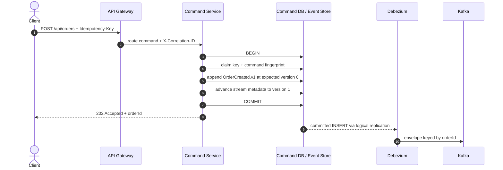
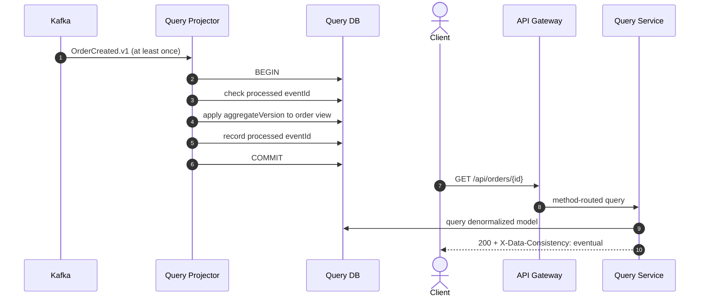

# Architecture

## Context and goals

This repository uses a small order lifecycle to expose the mechanics of an event-sourced CQRS system. Each service owns its database, command decisions derive only from aggregate history, and cross-service state propagation is visible as a versioned event.

The design favors explicit guarantees and local reproducibility. Event sourcing adds operational and modeling cost, so it should be selected where retaining business history, temporal reconstruction, auditability, or event-driven integration justifies that cost.

## Command and capture flow



The command service never calls Kafka. Its local transaction contains the command idempotency claim, the immutable event insert, and the stream-version update. PostgreSQL's deferred foreign key allows the idempotency claim and new aggregate stream to be created in that order while still committing atomically.

Debezium uses PostgreSQL's `pgoutput` logical-decoding plugin and a publication restricted to `public.order_events`. The Outbox Event Router single-message transform treats each event-store row as the publication record, extracts its JSONB payload, selects the Kafka key from `aggregate_id`, and routes `aggregate_type = orders` to `orders.events.v1`.

## Aggregate reconstruction

The `Order` domain object is persistence-agnostic. Loading an order reads events by `aggregate_version`, deserializes them to domain events, and applies them in sequence:

```text
OrderCreated.v1  -> CREATED, version 1
OrderCancelled.v1 -> CANCELLED, version 2
```

New decisions record uncommitted events. The event store locks the small `aggregate_streams` metadata row, verifies the expected version, inserts the next event, and advances `current_version` in the same transaction. This avoids rewriting historical rows while rejecting two writers attempting the same stream position.

The metadata table is not an alternate source of business state. It contains only aggregate identity, type, and current version for concurrency control and referential integrity.

## Projection and query flow



The Kafka listener's database transaction includes both projection state and the processed-event record. The listener acknowledges only after that transaction returns. A redelivery after an acknowledgement failure becomes a no-op because `eventId` is already recorded.

## Event contract

The JSONB stored in `order_events.payload` is the integration envelope emitted to Kafka:

```json
{
  "eventId": "b67c1f1c-c391-4ef0-a1b2-c54bc632a4aa",
  "eventType": "OrderCreated.v1",
  "aggregateId": "42989fcc-11b0-4c63-af36-533fdef5927b",
  "aggregateVersion": 1,
  "occurredAt": "2026-01-10T10:15:30Z",
  "payload": {
    "customerId": "customer-42",
    "status": "CREATED",
    "totalAmount": 208.90,
    "items": [],
    "createdAt": "2026-01-10T10:15:30Z"
  }
}
```

- `eventId` is globally unique and is the consumer idempotency key.
- `eventType` includes the major contract version.
- `aggregateId` identifies the stream and Kafka partition key.
- `aggregateVersion` is contiguous within the stream and guards projections from stale transitions.
- `occurredAt` is domain-event time and remains part of the immutable envelope.
- `payload` contains event-specific facts.

Optional fields can be added compatibly. A breaking semantic or structural change creates a new event type such as `OrderCreated.v2`; consumers can support both versions during migration.

## Data ownership and rebuilds

The command PostgreSQL instance owns event streams and command idempotency records. The query PostgreSQL instance owns a denormalized, disposable projection. Neither service reads or writes the other database.

The read model can be rebuilt by resetting its projection state and replaying `orders.events.v1` from the beginning while retained Kafka history is available. A longer-term rebuild strategy can republish the authoritative database event stream into a new topic or consumer group. That operational action must be controlled so a live projection is not accidentally mixed with a partial replay.

## Failure modes

| Failure | Observable result | Recovery |
| --- | --- | --- |
| Kafka unavailable after command commit | Event remains authoritative in PostgreSQL; query model lags | Debezium resumes from its replication offset |
| Debezium restarts after producing but before offset persistence | Event can be duplicated | `processed_events` deduplicates by `eventId` |
| Query database unavailable | Listener transaction fails and record is not acknowledged | Database recovery followed by Kafka redelivery |
| Malformed or unsupported event | Two retries, then DLT | Diagnose, correct or translate, and replay deliberately |
| Query immediately follows command | Temporary `404` is possible | Poll the `Location` resource or expose write-side status separately |
| Concurrent create retries with same key and payload | One claimant creates the stream; waiters replay it | Return one order ID and replay metadata |
| Idempotency key reused with another payload | Stored fingerprint differs | Return `409 Conflict` without another event |
| Concurrent cancellation retries | Metadata-row lock serializes replay and append | Only the first transition appends version 2 |
| Attempted event update or delete | Database trigger aborts the statement | Correct with a compensating event, never history mutation |

## Scaling and production path

- Scale gateway and command instances statelessly; PostgreSQL uniqueness and stream locks coordinate writes.
- Increase Kafka partitions and query consumers together. Keeping `aggregateId` as the key preserves per-stream order.
- Monitor replication-slot lag, Kafka consumer lag, connector/task state, DLT depth, command latency, and projection latency.
- Use managed secrets, TLS, Kafka ACLs, and a least-privilege replication identity outside local development.
- Add periodic aggregate snapshots only when measured replay cost requires them. Snapshots are derived caches, never replacements for history.
- Add a schema registry or consumer-driven contract checks as the number of event producers and consumers grows.

Authentication, service discovery, orchestration manifests, a tracing backend, and snapshotting are outside this compact implementation. The gateway is the natural OAuth2/OIDC enforcement point; Actuator exposes health and metrics integration points.
