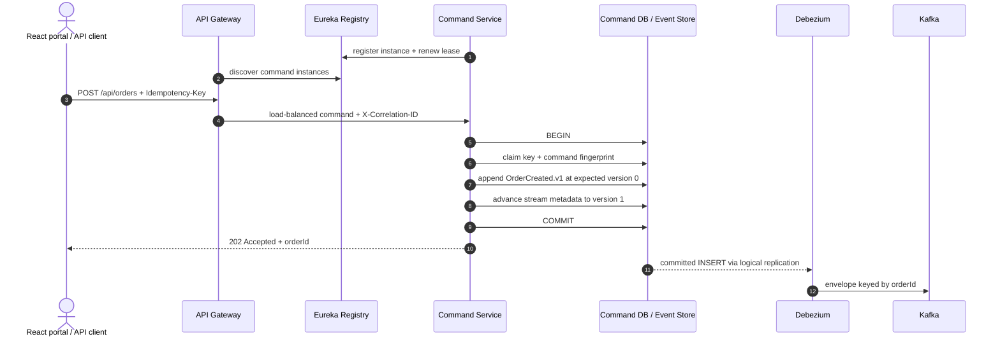
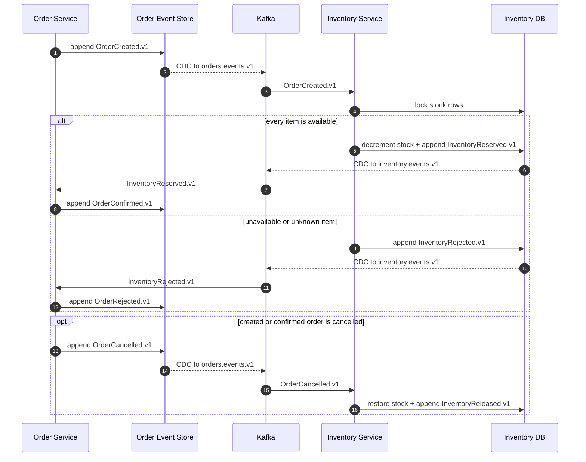
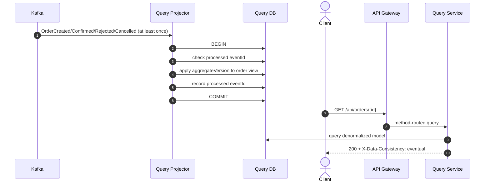

# Architecture

## Context and goals

This repository uses an order-and-inventory lifecycle to expose the mechanics of event-sourced CQRS and a choreographed saga. Each service owns its database, aggregate decisions derive from local history, cross-service transitions are visible as versioned events, and replicated services are reached through registry-backed routing.

The design favors explicit guarantees and local reproducibility. Event sourcing adds operational and modeling cost, so it should be selected where retaining business history, temporal reconstruction, auditability, or event-driven integration justifies that cost.

## User interface and service boundary

The React order portal is a stateless client of the API gateway. It creates orders, retries a command with the same idempotency key, verifies conflicting-key rejection, waits for inventory confirmation, polls the eventually consistent read model, cancels an order, searches the customer projection, and verifies the independent serverless activity view. Browser and API clients use the same public origin: `/api` reaches Spring Cloud Gateway and `/serverless` reaches the read-only Azure Function through Caddy. The UI never reaches a database, Kafka, Debezium, Eureka, or a backend instance directly.

`customerId` is an identity boundary input to the order context, not a locally owned customer record. A Customer service would be appropriate when this system owns customer profiles, authentication, consent, addresses, or lifecycle rules and can define an independent bounded context. Adding one only to populate this portal would create a distributed join and another operational dependency without a separate business capability, so the compact architecture deliberately keeps customer identity external.

## Command and capture flow



The command service never calls Kafka. Its local transaction contains the command idempotency claim, the immutable event insert, and the stream-version update. PostgreSQL's deferred foreign key allows the idempotency claim and new aggregate stream to be created in that order while still committing atomically.

Debezium uses PostgreSQL's `pgoutput` logical-decoding plugin and a publication restricted to `public.order_events`. The Outbox Event Router single-message transform treats each event-store row as the publication record, extracts its JSONB payload, selects the Kafka key from `aggregate_id`, and routes `aggregate_type = orders` to `orders.events.v1`.

## Order and inventory saga



`InventoryReservation` is event-sourced: replaying its stream determines whether it is reserved, rejected, or released, which items must be restored, and whether compensation is still eligible. `stock_items` is intentionally a mutable, row-locked balance. The service does not implement replenishment and adjustment as a complete event history, so claiming that balance was event-sourced would create a false rebuild guarantee.

The stock mutation and reservation event append occur in one inventory-database transaction. Debezium publishes only committed `inventory_events` rows to `inventory.events.v1`; there is no application-level database/Kafka dual write and no duplicate outbox record. Each saga consumer stores the incoming event ID in its local inbox transaction. A delivery repeated before or after acknowledgement therefore converges without another domain transition.

Choreography is kept deliberately small. With Order and Inventory, the event flow remains linear and each event has a natural owner. A third consequential participant, workflow-wide deadlines, branching compensation, or a required operator-facing workflow state is the point to introduce an orchestrator rather than extending the event chain indefinitely.

## Aggregate reconstruction

The `Order` domain object is persistence-agnostic. Loading an order reads events by `aggregate_version`, deserializes them to domain events, and applies them in sequence:

```text
OrderCreated.v1   -> CREATED, version 1
OrderConfirmed.v1 -> CONFIRMED, version 2
OrderRejected.v1  -> REJECTED, version 2
OrderCancelled.v1 -> CANCELLED, version 2 or 3
```

New decisions record uncommitted events. The event store locks the small `aggregate_streams` metadata row, verifies the expected version, inserts the next event, and advances `current_version` in the same transaction. This avoids rewriting historical rows while rejecting two writers attempting the same stream position.

The metadata table is not an alternate source of business state. It contains only aggregate identity, type, and current version for concurrency control and referential integrity.

## Projection and query flow



The Kafka listener's database transaction includes both projection state and the processed-event record. The listener acknowledges only after that transaction returns. A redelivery after an acknowledgement failure becomes a no-op because `eventId` is already recorded.

## Independent serverless activity projection

The order event stream also supports a separately deployable activity projection. `order-activity-function` is a Java 21 Azure Function with a Kafka trigger and an Azure Cosmos DB output binding. Each invocation validates one versioned event envelope and writes an activity document with this shape:

```json
{
  "id": "b67c1f1c-c391-4ef0-a1b2-c54bc632a4aa",
  "orderId": "42989fcc-11b0-4c63-af36-533fdef5927b",
  "eventType": "OrderCreated.v1",
  "aggregateVersion": 1,
  "occurredAt": "2026-01-10T10:15:30Z",
  "payload": {
    "customerId": "customer-42",
    "status": "CREATED"
  }
}
```

Cosmos DB uses `/orderId` as the partition key, keeping one order's timeline in one logical partition. The immutable event ID is also the document ID. Azure Functions' Cosmos output binding replaces a document when the same ID and partition key are written again, which makes at-least-once Kafka delivery converge on one document per event.

Transient execution failures retry indefinitely with exponential backoff capped at one minute between attempts, preserving the affected partition's offset until its dependency recovers. Invalid envelopes are published to `orders.events.v1.activity.DLT` so one poison event cannot stall its Kafka partition.

This projection is an independent observer. Command handling and the primary query API retain their PostgreSQL ownership and availability when the Function or Cosmos DB is unavailable. A read-only HTTP Function queries one order partition for the portal's live proof without placing Cosmos DB in the primary query path. The document model is appropriate for a schema-flexible timeline whose event-specific payload varies, while the relational query model remains appropriate for current-order searches and constraints.

## Asynchronous messaging and cloud service models

Kafka supplies the asynchronous messaging boundary. Producers and consumers are decoupled in time, retained records can be replayed, consumer groups track independent progress, and a partition key preserves per-order ordering. Azure Service Bus would add another broker and delivery hop without a separate messaging requirement, so the architecture uses one durable event backbone.

The cloud artifacts map the common service models to concrete ownership boundaries:

| Model | Project example | Current state | Responsibility boundary |
| --- | --- | --- | --- |
| IaaS | Azure Linux VM, virtual network, network interface, and managed disk | Public runtime | Azure operates physical infrastructure; the project operates the guest OS, Docker, and services |
| PaaS / FaaS | Azure Blob Storage for Terraform state | Active deployment foundation | Azure operates the storage platform and durability mechanisms |
| PaaS / FaaS | Azure Functions and Azure Cosmos DB for NoSQL | Active independent projection | Azure operates the service runtime, scaling mechanism, patching, and document platform |
| SaaS | GitHub repository and GitHub Actions | Active source-control and delivery platform | The project consumes source-control and CI/CD capabilities as hosted software |

Azure Functions is the Azure equivalent of the event-driven compute model associated with AWS Lambda. A second Lambda implementation would duplicate the same handler without adding another business boundary.

## Server-side discovery and horizontal scaling

External clients know only the gateway's stable address. Command, Inventory, and query instances self-register with Eureka and renew short-lived leases. The gateway resolves the command and query APIs through Spring Cloud LoadBalancer; Inventory has no public route and participates only through Kafka.

The default Compose topology runs two command replicas and two query replicas. Backend host ports are assigned dynamically to avoid collisions; service traffic uses the private Compose network and discovered instance addresses. The scaling acceptance test stops each replica in turn, waits until Eureka removes it, and verifies that the gateway continues serving traffic through its peer.

Command replicas are stateless. PostgreSQL owns client idempotency claims, aggregate stream locks, expected versions, and the atomic event append. Query replicas share one Kafka consumer group, so partitions are assigned across the active consumers; the aggregate ID remains the Kafka key, preserving per-stream order. Every query replica reads the same query database, while the processed-event table and aggregate version make redelivery idempotent.

The local registry uses short lease and eviction intervals and disables Eureka self-preservation so failover is deterministic and observable. A production deployment should run a highly available registry with self-preservation enabled, or replace Eureka with the deployment platform's native service registry and load balancer.

## Event contract

The JSONB stored in `order_events.payload` is the integration envelope emitted to Kafka:

```json
{
  "eventId": "b67c1f1c-c391-4ef0-a1b2-c54bc632a4aa",
  "eventType": "OrderCreated.v1",
  "aggregateId": "42989fcc-11b0-4c63-af36-533fdef5927b",
  "aggregateVersion": 1,
  "occurredAt": "2026-01-10T10:15:30Z",
  "payload": {
    "customerId": "customer-42",
    "status": "CREATED",
    "totalAmount": 208.90,
    "items": [],
    "createdAt": "2026-01-10T10:15:30Z"
  }
}
```

- `eventId` is globally unique and is the consumer idempotency key.
- `eventType` includes the major contract version.
- `aggregateId` identifies the stream and Kafka partition key.
- `aggregateVersion` is contiguous within the stream and guards projections from stale transitions.
- `occurredAt` is domain-event time and remains part of the immutable envelope.
- `payload` contains event-specific facts.

Optional fields can be added compatibly. A breaking semantic or structural change creates a new event type such as `OrderCreated.v2`; consumers can support both versions during migration.

Inventory events use the same envelope fields and `orderId` as `aggregateId` and Kafka key. `InventoryReserved.v1` carries the normalized reserved items, `InventoryRejected.v1` carries the stable rejection reason, and `InventoryReleased.v1` records completion of compensation. They are stored in `inventory_events` and routed to `inventory.events.v1`.

## Data ownership and rebuilds

The command PostgreSQL instance owns order event streams, command idempotency records, and the inventory-event inbox. Inventory PostgreSQL owns current stock, inventory reservation streams, and the order-event inbox. The query PostgreSQL instance owns a denormalized, disposable projection. No service reads or writes another service's database.

The read model can be rebuilt by resetting its projection state and replaying `orders.events.v1` from the beginning while retained Kafka history is available. A longer-term rebuild strategy can republish the authoritative database event stream into a new topic or consumer group. That operational action must be controlled so a live projection is not accidentally mixed with a partial replay.

The first saga rollout does not use Kafka retention as a migration boundary. Deployment finishes the application and image builds, stops command ingress, and then persists a one-time `SAGA_ACTIVATION_AT` timestamp before replacing the services. Inventory acknowledges but does not reserve for older order events. In the same release, the command-store migration appends a deterministic confirmation event to every previously accepted, still-created order. This grandfathers the complete pre-saga population without reducing newly seeded inventory. The query projector uses a new consumer-group generation so an old replica cannot consume and dead-letter a new terminal event during the replacement. Local startup persists the same boundary in `.runtime/` so existing database volumes follow the upgrade path; `make down` removes it together with those volumes.

## Failure modes

| Failure | Observable result | Recovery |
| --- | --- | --- |
| Kafka unavailable after command commit | Event remains authoritative in PostgreSQL; query model lags | Debezium resumes from its replication offset |
| Inventory unavailable after order creation | Order remains visibly `CREATED` | Kafka retains the event; Inventory reserves or rejects after recovery |
| Inventory result is redelivered | Consumer sees an existing inbox event ID | Commit no additional order transition |
| Order is cancelled after reservation | Order reaches `CANCELLED` before Inventory may finish | Inventory consumes the cancellation, restores stock, and appends `InventoryReleased.v1` |
| Inventory rejects a request | No stock row is changed | Order consumes `InventoryRejected.v1` and reaches `REJECTED` |
| Debezium restarts after producing but before offset persistence | Event can be duplicated | `processed_events` deduplicates by `eventId` |
| Query database unavailable | Listener transaction fails and record is not acknowledged | Database recovery followed by Kafka redelivery |
| Malformed or unsupported event | Two retries, then DLT | Diagnose, correct or translate, and replay deliberately |
| Query immediately follows command | Temporary `404` is possible | Poll the `Location` resource or expose write-side status separately |
| Concurrent create retries with same key and payload | One claimant creates the stream; waiters replay it | Return one order ID and replay metadata |
| Idempotency key reused with another payload | Stored fingerprint differs | Return `409 Conflict` without another event |
| Concurrent cancellation retries | Metadata-row lock serializes replay and append | Only the first transition appends cancellation at the next version |
| Attempted event update or delete | Database trigger aborts the statement | Correct with a compensating event, never history mutation |
| One command or query replica stops | Eureka lease expires and the gateway refreshes its instance list | Traffic continues through the surviving replica |
| Registry unavailable after clients have cached instances | Existing cache can serve temporarily; topology changes are not discovered | Restore the registry; run it redundantly outside local development |
| Activity Function or Cosmos DB unavailable | The primary command and query paths continue; the affected activity partition pauses | The Kafka consumer group retries with exponential backoff until recovery; deterministic document IDs absorb redelivery |

## Cloud deployments and production path

The credit-protected Azure environment also packages the complete topology onto one encrypted two-vCPU/eight-GiB VM. Inventory adds one PostgreSQL process and one Spring service, so the economical deployment uses explicit 256 MiB and 512 MiB container ceilings for them. This is a demonstration topology with constrained headroom, not a production capacity recommendation. It also adds a stable Azure DNS name, Caddy-managed HTTPS, private versioned Blob state, an Entra workload identity federated to GitHub Actions, Azure Run Command, boot diagnostics, and an explicit budget. Provisioning is allowed only while the Azure subscription is enabled with its spending limit set to `On`. See [Azure cloud deployment](azure-deployment.md) and [ADR-004](adr/004-credit-protected-azure-deployment.md).

The cost-optimized AWS environment packages the complete topology onto one encrypted EC2 host, places an API Gateway HTTP API at the public boundary, and uses Terraform, S3 remote state, GitHub OIDC, Systems Manager, CloudWatch, and explicit budgets for repeatable operations. Container memory limits reflect the measured runtime footprint, internal ports remain private, and the management endpoint is separated from public gateway traffic. See [AWS cloud deployment](aws-deployment.md) and [ADR-003](adr/003-cost-optimized-aws-deployment.md).

Both economical environments demonstrate application-level replica behavior but deliberately do not describe one host as highly available. The production evolution is:

- Scale gateway and command instances statelessly; PostgreSQL uniqueness and stream locks coordinate writes.
- Increase Kafka partitions and query consumers together. Keeping `aggregateId` as the key preserves per-stream order.
- Monitor replication-slot lag, Kafka consumer lag, connector/task state, DLT depth, command latency, and projection latency.
- Use managed secrets, TLS, Kafka ACLs, and a least-privilege replication identity outside local development.
- Add periodic aggregate snapshots only when measured replay cost requires them. Snapshots are derived caches, never replacements for history.
- Add a schema registry or consumer-driven contract checks as the number of event producers and consumers grows.

Authentication, customer-profile ownership, payment, shipping, a tracing backend, and snapshotting are outside this compact implementation. The gateway is the natural OAuth2/OIDC enforcement point; a future identity provider supplies the authenticated customer identifier, while Actuator exposes health and metrics integration points.

[ADR-006](adr/006-choreographed-order-inventory-saga.md) records the choreography boundary, selective event-sourcing decision, compensation semantics, and the conditions that would justify orchestration.
