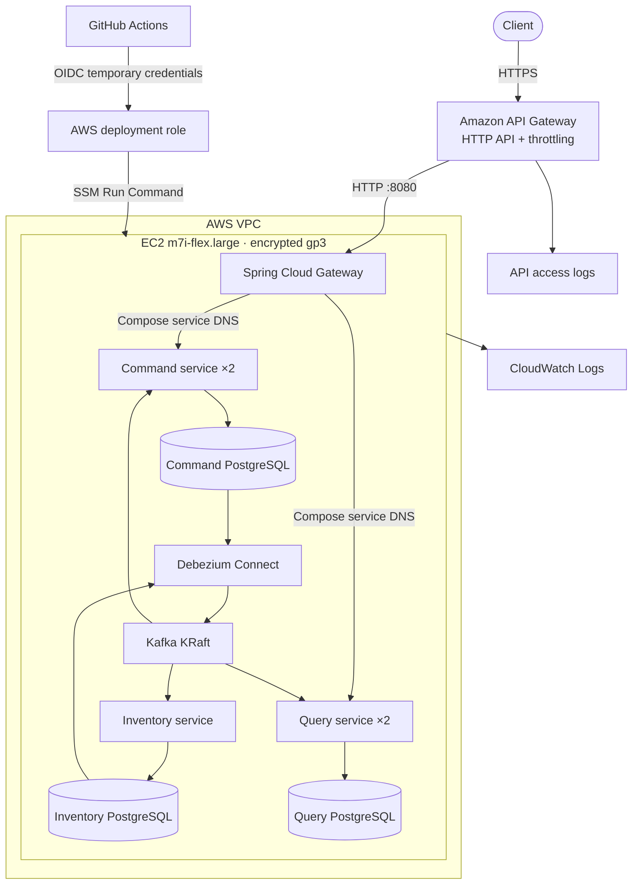

# AWS cloud deployment

This deployment keeps the complete application topology intact while minimizing fixed cloud cost. Terraform provisions an AWS HTTPS entry point, networking, identity, compute, remote state, logs, alarms, and a monthly budget. Docker Compose runs three PostgreSQL databases, Kafka, Debezium, the gateway, two Order command replicas, two query replicas, and one Inventory service on one eight-GiB EC2 instance.

Current public API: [https://n6jxpgtbrc.execute-api.eu-central-1.amazonaws.com/](https://n6jxpgtbrc.execute-api.eu-central-1.amazonaws.com/)



## Why one deployment host

The Inventory database and service have 256 MiB and 512 MiB container limits. The Free-plan-eligible, eight-GiB `m7i-flex.large` is the configured economical shape, but the complete single-host topology must be measured under representative load before treating it as a capacity baseline.

This is a cost-optimized environment, not a claim of infrastructure high availability. It proves the same event sourcing, CDC, consumer idempotency, platform DNS routing, and replica behavior as the local topology. A production topology would place stateless services on ECS or EKS and use their managed service routing with multi-AZ databases and Kafka.

## Cost boundary

This topology is not permanently always-free. New AWS customers can choose the [AWS Free plan](https://aws.amazon.com/free/) and receive credits for up to six months; existing or upgraded paid accounts are charged at standard service rates. The Terraform budget is an alerting control, not a hard spending cap. Check account eligibility before provisioning, provide `BUDGET_ALERT_EMAIL` for notifications, and destroy the runtime whenever the public environment is not needed.

## Provision

Prerequisites:

- an authenticated AWS account whose plan permits the selected services and has enough credit or budget for them;
- AWS CLI with `aws sts get-caller-identity` succeeding;
- Terraform 1.15.x;
- an authenticated GitHub CLI session with repository and workflow access.

No AWS access key is stored in GitHub. Terraform creates a GitHub OIDC trust restricted to the repository's immutable numeric identity and `cloud` environment, and the workflow receives short-lived credentials for one Systems Manager deployment command. The provisioner reads the owner and repository IDs from GitHub, configures the matching AWS trust first, and then explicitly enables GitHub's immutable OIDC subject format.

For an AWS account that uses normal Console credentials, current AWS CLI releases can establish the required temporary local session with `aws login --region eu-central-1`; no long-lived access key is needed.

From the repository root:

```bash
AWS_REGION=eu-central-1 \
BUDGET_ALERT_EMAIL=your-address@example.com \
AUTO_APPROVE=true \
  make cloud-provision
```

The command performs the complete bootstrap:

1. creates a private, encrypted, versioned S3 state bucket;
2. enables S3-native state locking and applies the runtime infrastructure;
3. creates the GitHub `cloud` environment and its non-secret deployment variables; and
4. starts the `Deploy to AWS` workflow.

The workflow checks out the exact tested revision, assumes the deployment role with GitHub OIDC, deploys through Systems Manager without SSH, and runs the complete public reservation, confirmation, compensation, rejection, and projection smoke test through the HTTPS API Gateway URL.

## Operations

Every container sends stdout and stderr to `/event-sourced-cqrs/cloud/containers` in CloudWatch Logs. API Gateway writes structured access logs to `/event-sourced-cqrs/cloud/api-gateway`. Both groups retain seven days. EC2 status checks have a CloudWatch alarm, and API Gateway limits the default route to 10 requests per second with a burst of 20.

Only EC2 port 8080 accepts internet traffic. Database, Kafka, backend service, Debezium, and management ports are not publicly reachable. Systems Manager provides the administrative channel; the security group deliberately has no SSH rule and the instance requires IMDSv2.

Subsequent successful CI runs on `main` deploy automatically. A manual deployment is also available from the `Deploy to AWS` workflow.

## Remove chargeable resources

The destroy target requires an explicit confirmation value:

```bash
CONFIRM_DESTROY=event-sourced-cqrs make cloud-destroy
```

This removes the runtime resources while preserving the small versioned S3 state bucket. Retaining state makes later recovery possible; delete the bucket separately only after confirming that no managed infrastructure remains and no state version is needed.
