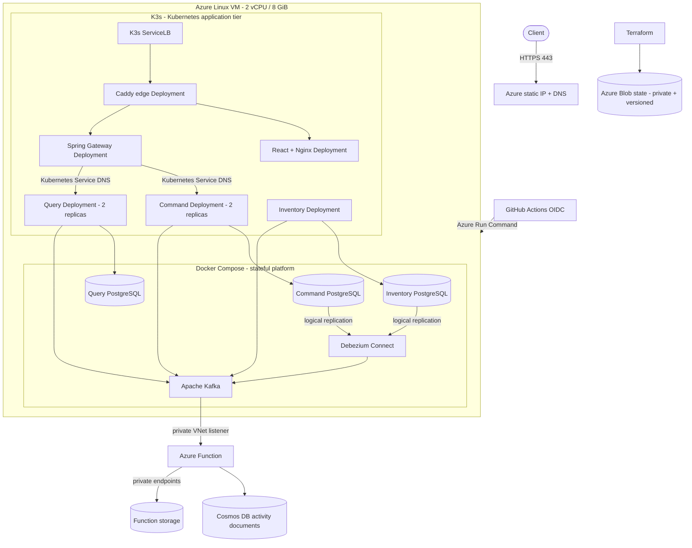

# Azure cloud deployment

## Purpose and cost boundary

This deployment keeps the complete event-sourced CQRS topology available on Azure while adding a real Kubernetes application tier within the existing credit-protected cost model. Terraform provisions one hardened Linux VM, a Flex Consumption Function App, a free-tier Cosmos DB for NoSQL activity view, a stable public DNS name, HTTPS termination, versioned remote state, a cost budget, and a short-lived GitHub OIDC delivery identity. The VM runs a pinned K3s distribution for stateless workloads and Docker Compose for the retained stateful platform.

Verified React order portal and API endpoint: [https://escqrs-62636a3dc4.polandcentral.cloudapp.azure.com](https://escqrs-62636a3dc4.polandcentral.cloudapp.azure.com)

The tested `Standard_B2as_v2` VM has two vCPUs and 8 GiB of memory. A measurement before the Kubernetes migration showed about 4.7 GiB in use and 3.1 GiB available. K3s replaces the Compose application containers and Eureka rather than duplicating them, leaving enough measured headroom for its control plane and containerd. This remains a constrained demonstration target, not a production capacity recommendation.

The VM is not one of Azure's 12-month free shapes; promotional credit funds it. `scripts/azure/verify-free-plan.sh` blocks provisioning unless the subscription is `Enabled` and its spending limit is `On`, so Azure stops resources instead of charging a payment method when included credit is exhausted. The public service therefore remains available only while promotional credit or another credit-backed allowance remains active.

The design avoids a multi-node Azure Kubernetes Service cluster because its recurring compute cost is outside the USD 25 resource-group budget. Cosmos DB is fixed at 400 RU/s inside its lifetime free-tier allowance. The Function keeps one Kafka projection instance always ready and caps burst scale at two instances. Three storage private endpoints add a small fixed hourly cost in exchange for denying public access to the Function's blob, queue, and table services. The budget is an alert, not a spending cap; the subscription spending limit is the no-charge boundary.

## Architecture



Kubernetes owns the command, query, Inventory, gateway, frontend, and edge workloads in the `cqrs-orders` namespace. Deployments use immutable commit-SHA image tags, rolling-update policy, startup/readiness/liveness probes, graceful termination, explicit resource requests and limits, runtime-default seccomp, restricted service-account token mounting, and ingress NetworkPolicies. Kustomize owns the reusable base and Azure overlay. The edge keeps certificate state in a one-GiB local-path persistent volume.

Eureka is not deployed on Azure. The gateway receives direct Kubernetes Service URIs, and application pods disable the Eureka client. Local Compose retains Eureka so the local discovery and replica-failover exercise remains available.

PostgreSQL, Kafka, and Debezium stay in Compose for this increment to preserve existing data volumes, replication slots, connector offsets, and event history. Selectorless Kubernetes Services with explicit EndpointSlices map stable in-cluster names to the VM's private `10.42.1.4` platform listeners. K3s uses `10.244.0.0/16` for pods and `10.96.0.0/12` for Services so neither range overlaps the Azure virtual network's `10.42.0.0/16` address space.

Only ports 80 and 443 are public. K3s ServiceLB claims those host ports and forwards them to Caddy, which redirects HTTP to HTTPS, obtains and renews the certificate, routes `/api` to the gateway, `/serverless` to the Function, and browser paths to the frontend. PostgreSQL and Debezium bind only the VM's private address. The network security group permits the Function subnet to reach Kafka on `10.42.1.4:9094` and does not expose Kafka publicly. SSH has no inbound rule; Azure Run Command is the normal administration and deployment path.

This one-node cluster is not highly available. A VM failure stops the synchronous path and Kafka processing, the Caddy volume is node-local, and images are imported into the single node's containerd store. A production topology should use multi-node AKS, a managed registry, managed multi-zone PostgreSQL, and a managed Kafka-compatible service. [ADR-007](adr/007-incremental-kubernetes-application-tier.md) records why this migration stops at the stateless boundary.

## Provision

Prerequisites:

- an Azure subscription with active credit and spending protection;
- Azure CLI 2.89.1 or newer;
- Terraform 1.15.x;
- GitHub CLI authenticated for the repository; and
- permission to create Entra applications and role assignments in the subscription.

Keep Azure CLI state outside the repository and sign in interactively:

```bash
export AZURE_CONFIG_DIR="$HOME/.cache/event-sourced-cqrs/azure"
mkdir -p "$AZURE_CONFIG_DIR"
az login
az account set --subscription '<subscription-id-or-name>'
```

Verify the no-charge boundary before planning anything:

```bash
./scripts/azure/verify-free-plan.sh
```

Provisioning deliberately requires interactive Terraform approval by default:

```bash
BUDGET_ALERT_EMAIL='name@example.com' ./scripts/azure/provision.sh
```

Set `AUTO_APPROVE=true` only in a controlled automation context after reviewing the plan. The provisioner:

1. verifies the subscription state and spending limit;
2. registers only the Azure resource providers required by the deployment;
3. creates a private, versioned Azure Storage backend;
4. waits for the Blob data-role assignment to propagate, then initializes remote state;
5. provisions networking, the VM, DNS, boot diagnostics, Flex Consumption, free-tier Cosmos DB, and the cost budget;
6. creates an Entra application with an immutable GitHub environment subject;
7. grants VM read and Run Command permissions plus Function deployment permission;
8. configures GitHub environment variables without long-lived Azure secrets; and
9. starts the Azure deployment workflow.

The recovery SSH private key is generated under `AZURE_CONFIG_DIR` and is never written to the repository or Terraform state. Port 22 remains closed.

## Delivery and verification

`.github/workflows/deploy-azure.yml` runs after successful `main` CI or by manual dispatch for a selected branch. Manual dispatch refuses a revision without successful exact-SHA CI, and manual CI reruns integration unless its parent is itself proven successful. GitHub exchanges its OIDC token for short-lived Azure credentials and deploys the exact checked-out commit. The Function package is updated first. Azure Run Command then installs or reconciles the pinned K3s version, preserves the Compose platform, builds application images from that commit, imports them into containerd, applies the Kustomize overlay, waits for every rollout, retires the superseded Compose application containers, registers both Debezium connectors idempotently, runs the saga smoke test through a gateway port-forward, retains one rollback image revision, and prunes older application images and excess build cache.

The workflow independently verifies that every Kubernetes application image uses the expected commit SHA, all Deployments are available, Eureka is absent, and the public saga, UI, HTTPS, and Kafka-to-Cosmos paths work. A successful workflow therefore proves the selected Git revision, the cluster rollout, and the externally observable behavior together.

Verify the public flow manually:

```bash
PUBLIC_API_URL="$(terraform -chdir=infra/azure output -raw public_api_url)"
GATEWAY_URL="$PUBLIC_API_URL" VERIFY_PLATFORM=false ./scripts/smoke-test.sh
UI_URL="$PUBLIC_API_URL" ./scripts/ui-smoke-test.sh
GATEWAY_URL="$PUBLIC_API_URL" ./scripts/serverless-smoke-test.sh
```

Inspect Kubernetes rollout and image identity through Azure Run Command:

```bash
az vm run-command invoke \
  --resource-group "$(terraform -chdir=infra/azure output -raw resource_group_name)" \
  --name "$(terraform -chdir=infra/azure output -raw vm_name)" \
  --command-id RunShellScript \
  --scripts 'sudo k3s kubectl --namespace cqrs-orders get deployments,pods,services -o wide'
```

Exercise replica replacement without relying on Eureka:

```bash
az vm run-command invoke \
  --resource-group "$(terraform -chdir=infra/azure output -raw resource_group_name)" \
  --name "$(terraform -chdir=infra/azure output -raw vm_name)" \
  --command-id RunShellScript \
  --scripts 'pod=$(sudo k3s kubectl --namespace cqrs-orders get pod -l app.kubernetes.io/name=order-command-service -o jsonpath="{.items[0].metadata.name}"); sudo k3s kubectl --namespace cqrs-orders delete pod "$pod"; sudo k3s kubectl --namespace cqrs-orders rollout status deployment/order-command-service --timeout=180s'
```

Both connectors must report one `RUNNING` connector and one `RUNNING` task:

```bash
az vm run-command invoke \
  --resource-group "$(terraform -chdir=infra/azure output -raw resource_group_name)" \
  --name "$(terraform -chdir=infra/azure output -raw vm_name)" \
  --command-id RunShellScript \
  --scripts 'for name in order-events inventory-events; do curl --fail --silent "http://10.42.1.4:8083/connectors/${name}/status"; done'
```

## Operations

- Disable automatic Azure delivery without changing infrastructure:

  ```bash
  gh variable set AZURE_DEPLOY_ENABLED --repo karacsonybarni/event-sourced-cqrs-microservices --body false
  ```

- Inspect bootstrap, cluster, platform, and deployment state:

  ```bash
  az vm run-command invoke \
    --resource-group "$(terraform -chdir=infra/azure output -raw resource_group_name)" \
    --name "$(terraform -chdir=infra/azure output -raw vm_name)" \
    --command-id RunShellScript \
    --scripts 'sudo cloud-init status --long; sudo systemctl status event-sourced-cqrs k3s --no-pager; sudo k3s kubectl --namespace cqrs-orders get pods,services; sudo docker compose -f /opt/event-sourced-cqrs/compose.yml -f /opt/event-sourced-cqrs/compose.azure.yml -f /opt/event-sourced-cqrs/compose.kubernetes-platform.yml ps'
  ```

- Stop compute billing while retaining the VM and disk:

  ```bash
  az vm deallocate \
    --resource-group "$(terraform -chdir=infra/azure output -raw resource_group_name)" \
    --name "$(terraform -chdir=infra/azure output -raw vm_name)"
  ```

  The static public IP and managed disk can continue accruing small charges while the VM is deallocated.

- Destroy the runtime only after reviewing the plan and exporting any data that must survive:

  ```bash
  terraform -chdir=infra/azure destroy
  ```

The Terraform state resource group is deliberately separate. Delete it only after the runtime is destroyed and its final state is no longer needed.
