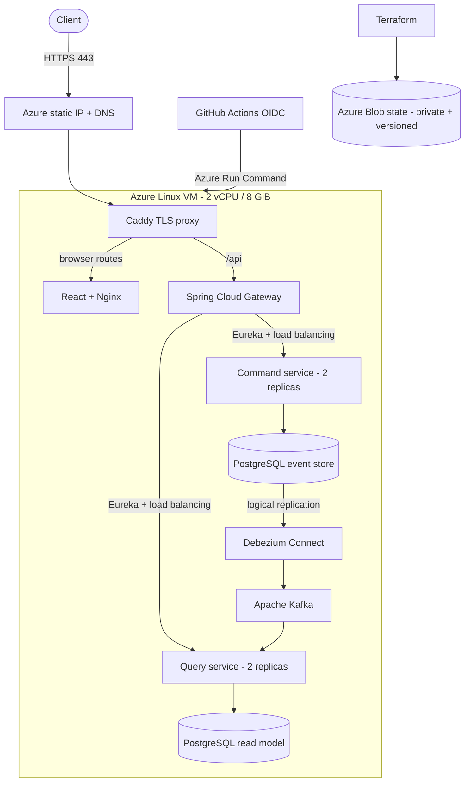

# Azure cloud deployment

## Purpose and cost boundary

This deployment keeps the complete event-sourced CQRS topology available on Azure while the runtime remains economical and reproducible. Terraform provisions one hardened Linux VM, a stable public DNS name, HTTPS termination, versioned remote state, a cost budget, and a short-lived GitHub OIDC delivery identity.

Verified React order portal and API endpoint: [https://escqrs-62636a3dc4.polandcentral.cloudapp.azure.com](https://escqrs-62636a3dc4.polandcentral.cloudapp.azure.com)

The deployment runs in Poland Central. Its public event-sourced create, query, and cancel flow, Debezium connector, two command replicas, two query replicas, single-replica failover, HTTPS certificate, management-port isolation, and Terraform state have been verified against the deployed environment.

The tested `Standard_B2as_v2` VM has two vCPUs and 8 GiB of memory. It is not one of Azure's 12-month free VM shapes; the Azure Free Account's promotional credit funds it. `scripts/azure/verify-free-plan.sh` blocks provisioning unless the subscription is `Enabled` and its spending limit is `On`, so Azure stops resources instead of charging a payment method when included credit is exhausted. The public service therefore remains available only while promotional credit or another credit-backed allowance remains active.

The design intentionally avoids Marketplace products and managed resources with fixed hourly platform fees. A resource-group budget adds an early cost signal but is not a spending cap; the subscription spending limit is the no-charge boundary.

## Architecture



Only ports 80 and 443 are permitted by the network security group. Caddy redirects HTTP to HTTPS, obtains and renews the public certificate, routes `/api` requests directly to the private gateway, and routes browser paths to the React application served by Nginx. A restrictive content security policy keeps the browser application on the same origin. Eureka, Debezium, Kafka, databases, backend replicas, and Actuator management ports remain on the VM's private Docker network or loopback interface. SSH has no inbound rule; Azure Run Command is the normal administration and deployment path.

Two command replicas and two query replicas demonstrate application-level discovery, routing, and failover. The one-VM placement is a cost constraint, not infrastructure high availability: a VM or availability-zone failure stops the complete environment. A production topology would move the services to a managed orchestrator, PostgreSQL to Flexible Server, and Kafka to a managed Kafka-compatible service across failure domains.

## Provision

Prerequisites:

- an Azure subscription with active credit and spending protection;
- Azure CLI 2.89.1 or newer;
- Terraform 1.15.x;
- GitHub CLI authenticated for the repository; and
- permission to create Entra applications and role assignments in the subscription.

Keep Azure CLI state outside the repository and sign in interactively:

```bash
export AZURE_CONFIG_DIR="$HOME/.cache/event-sourced-cqrs/azure"
mkdir -p "$AZURE_CONFIG_DIR"
az login
az account set --subscription '<subscription-id-or-name>'
```

Verify the no-charge boundary before planning anything:

```bash
./scripts/azure/verify-free-plan.sh
```

Provisioning deliberately requires interactive Terraform approval by default:

```bash
BUDGET_ALERT_EMAIL='name@example.com' ./scripts/azure/provision.sh
```

Set `AUTO_APPROVE=true` only in a controlled automation context after reviewing the plan. The provisioner:

1. verifies the subscription state and spending limit;
2. registers only the Azure resource providers required by the deployment;
3. creates a private, versioned Azure Storage backend;
4. waits for the Blob data-role assignment to propagate, then initializes remote state;
5. provisions networking, the VM, DNS, boot diagnostics, and the cost budget;
6. creates an Entra application with an immutable GitHub environment subject;
7. grants only VM read and Run Command permissions;
8. configures GitHub environment variables without long-lived Azure secrets; and
9. starts the Azure deployment workflow.

The recovery SSH private key is generated under `AZURE_CONFIG_DIR` and is never written to the repository or Terraform state. Port 22 remains closed.

## Delivery and verification

`.github/workflows/deploy-azure.yml` runs after successful `main` CI when `AZURE_DEPLOY_ENABLED=true`, or by manual dispatch. GitHub exchanges its OIDC token for short-lived Azure credentials and invokes the VM's locked deployment command. The VM fetches the exact CI revision, builds the Spring services and React application, reconciles the Compose topology, and runs the local CDC smoke test before the workflow tests both the public API flow and the deployed UI assets over HTTPS.

Verify manually after provisioning:

```bash
PUBLIC_API_URL="$(terraform -chdir=infra/azure output -raw public_api_url)"
GATEWAY_URL="$PUBLIC_API_URL" VERIFY_PLATFORM=false ./scripts/smoke-test.sh
```

Use Azure Run Command for the multi-replica failover check:

```bash
az vm run-command invoke \
  --resource-group "$(terraform -chdir=infra/azure output -raw resource_group_name)" \
  --name "$(terraform -chdir=infra/azure output -raw vm_name)" \
  --command-id RunShellScript \
  --scripts 'cd /opt/event-sourced-cqrs && sudo ./scripts/scaling-test.sh'
```

The connector must report one `RUNNING` connector and one `RUNNING` task:

```bash
az vm run-command invoke \
  --resource-group "$(terraform -chdir=infra/azure output -raw resource_group_name)" \
  --name "$(terraform -chdir=infra/azure output -raw vm_name)" \
  --command-id RunShellScript \
  --scripts 'curl --fail --silent http://localhost:8083/connectors/order-events/status'
```

## Operations

- Disable automatic Azure delivery without changing infrastructure:

  ```bash
  gh variable set AZURE_DEPLOY_ENABLED --repo karacsonybarni/event-sourced-cqrs-microservices --body false
  ```

- Inspect bootstrap and deployment state:

  ```bash
  az vm run-command invoke \
    --resource-group "$(terraform -chdir=infra/azure output -raw resource_group_name)" \
    --name "$(terraform -chdir=infra/azure output -raw vm_name)" \
    --command-id RunShellScript \
    --scripts 'sudo cloud-init status --long; sudo systemctl status event-sourced-cqrs --no-pager'
  ```

- Stop compute billing while retaining the VM and disk:

  ```bash
  az vm deallocate \
    --resource-group "$(terraform -chdir=infra/azure output -raw resource_group_name)" \
    --name "$(terraform -chdir=infra/azure output -raw vm_name)"
  ```

  The static public IP and managed disk can continue accruing small charges while the VM is deallocated.

- Destroy the runtime only after reviewing the plan and exporting any data that must survive:

  ```bash
  terraform -chdir=infra/azure destroy
  ```

The Terraform state resource group is deliberately separate. Delete it only after the runtime is destroyed and its final state is no longer needed.
